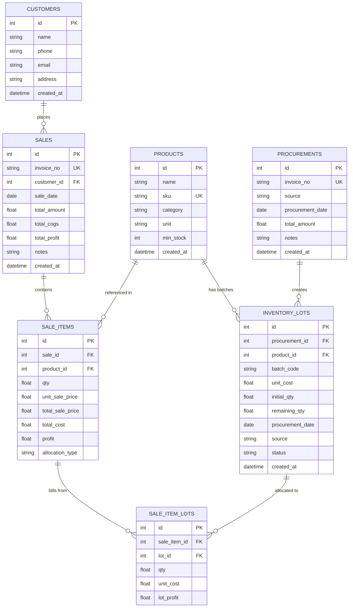

# System Architecture & Technical Specifications

This document outlines the architecture, data models, algorithm specifications, and design patterns of the **Apex Inventory & Sales Management System**.

---

## 1. Multi-Batch Inventory & Costing Model

### The Business Challenge
In standard retail and e-commerce distribution, the same physical product (e.g. *Wireless Mouse*) is procured over time at different prices and from different channels:
- *Lot A*: Procured from **Wholesale Hub** on Aug 15 at **$7.50/unit** (bulk discount).
- *Lot B*: Procured from **E-Commerce** on Aug 25 at **$9.00/unit**.
- *Lot C*: Procured via **Quick Commerce** on Sep 02 at **$11.20/unit** (urgent restock).

If an inventory system uses a simple blended average cost, accurate profitability per transaction is lost. This system treats every procurement shipment as an immutable **Inventory Lot**, with its own unit cost, initial quantity, remaining quantity, date, and source.

---

## 2. Allocation Strategies

### A. Lowest-Cost-First (Cheapest-First) Allocation (Default)
When a salesperson prepares a bill:
1. The system queries all active lots (`remaining_qty > 0`) for the selected product.
2. Lots are sorted by:
   $$\text{ORDER BY } \text{unit\_cost ASC}, \text{procurement\_date ASC}$$
3. Units are deducted from the lowest-cost lot first until the requested quantity is satisfied.
4. If the sale quantity spans multiple lots, the system automatically splits the deduction across lots:
   $$\text{COGS} = \sum_{i=1}^{k} \left( q_i \times \text{unit\_cost}_i \right)$$
   where $q_i$ is the quantity allocated from lot $i$.
5. When a lot reaches $\text{remaining\_qty} = 0$, its status is atomically set to `'depleted'`.

### B. Manual Lot Selection Override
If a salesperson wishes to bill a specific batch (e.g., billing an item procured at Price 1 instead of Price 2):
1. The salesperson triggers the "Choose Batch / Override" modal.
2. The UI lists all available lots with their source, date, cost price, and available balance.
3. The salesperson enters the exact quantity to draw from each specific lot.
4. The server validates that:
   - The sum of manual lot quantities exactly matches the requested line item quantity.
   - Every selected lot has sufficient `remaining_qty`.
5. The sale commits using the specified lots, preserving exact audit lineage.

---

## 3. Database Entity-Relationship (ER) Schema



---

## 4. Granular Analytics Engine (Day to Year)

The backend handles multi-scale time series aggregation directly in SQLite using optimized index queries:
- **Day**: Grouped by `strftime('%Y-%m-%d', sale_date)`
- **Week**: Grouped by `strftime('%Y-W%W', sale_date)`
- **Month**: Grouped by `strftime('%Y-%m', sale_date)`
- **Year**: Grouped by `strftime('%Y', sale_date)`

### Mathematical Metrics
- **Revenue**: $\sum (\text{qty} \times \text{unit\_sale\_price})$
- **Cost of Goods Sold (COGS)**: $\sum (\text{qty\_from\_lot} \times \text{unit\_cost})$
- **Net Profit**: $\text{Revenue} - \text{COGS}$
- **Profit Margin %**: $\left( \frac{\text{Net Profit}}{\text{Revenue}} \right) \times 100$
- **Average Sale Price**: $\frac{\text{Revenue}}{\text{Units Sold}}$
- **Average Cost Price**: $\frac{\text{COGS}}{\text{Units Sold}}$

---

## 5. React Component Hierarchy

```
App
├── Navbar
│   ├── Logo & Brand
│   ├── Live Store Valuation & Stock Summary
│   ├── Navigation Tabs (Analytics, POS, Procurement, Stock, Invoices)
│   └── Quick Action Buttons (New Sale, Procure Stock)
├── AnalyticsView
│   ├── Granularity Selector (Day, Week, Month, Year, Custom)
│   ├── Financial KPI Cards (Revenue, COGS, Net Profit, Margin %, Units Sold)
│   ├── Chart.js Financial Trend Bar/Line Canvas
│   └── Granular Item Profitability & Volume Table
├── SalesView
│   ├── Customer Selector & Date Picker
│   ├── Add Line Item Form (Product search, live stock & batch preview, price, margin preview)
│   ├── Cart Items & Lot Allocation Cards
│   └── Summary & Checkout Button
├── ProcurementView
│   ├── Source Selector (Wholesale, Quick Com, E-Com, Other)
│   ├── Multi-item Batch Cost Grid
│   └── Save Procurement & Create Lots
├── InventoryView
│   ├── Store KPI Cards
│   ├── Search & Category Filters
│   └── Product Table with Expandable Multi-Batch Accordion
├── InvoicesHistoryView
│   └── Invoices List with Quick Receipt Viewer
└── Modals
    ├── LotSelectorModal (Manual lot allocation override)
    ├── InvoiceModal (Printable sales receipt)
    ├── ProductModal (Quick add product)
    ├── CustomerModal (Quick add customer)
    └── ItemDetailModal (Audit trail drill-down)
```
